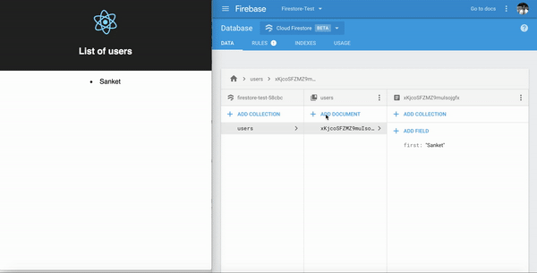

# [UNMAITAINED] We are no more maintaing this repo!

# Firestore Data Provider for React Component

`firestore-react` provides `createContainer()` function (inspired by Meteor) which creates a HOC to provide Firestore data for your React Components.

## Provides two things

1. Fetches data and passes down to the presentational components
2. Adds a subscriber to listen to live snapshot updates on the query and also removes the subscriber when component is unmounted.

## Installation

```
yarn add firestore-react
```

## Examples

[Simple List - Source Code](https://github.com/GeekyAnts/firestore-react/blob/master/examples/simple-list/src/App.tsx)

```ts

import createContainer from 'firestore-react';

class App extends React.Component {
  
  render() {
    // this.props.users.loading <= Gives you loading status
    // this.props.users.snapshot <= Gives you Firebase snapshot object of query and it automatically re-renders whenever snapshot updates
  }

}

const AppWithData = createContainer(App, (db) => {
  return {
    users: db.collection('users')
  }
})

```

## Quick Demo


